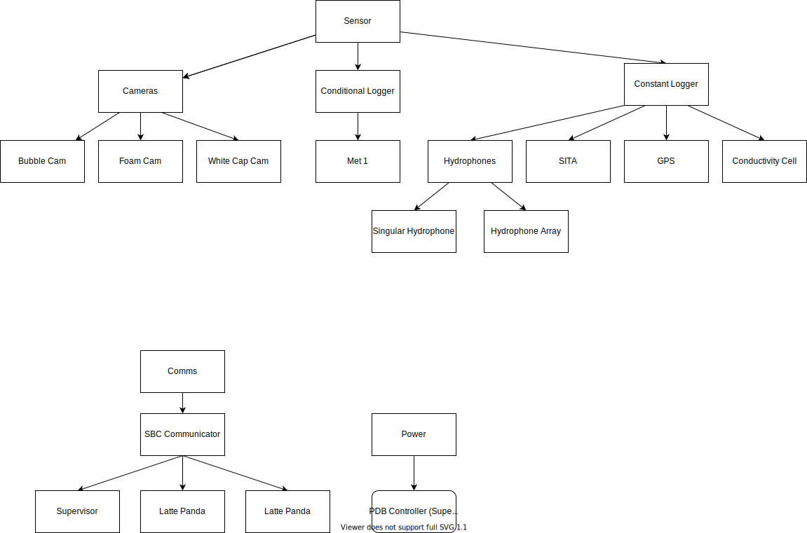
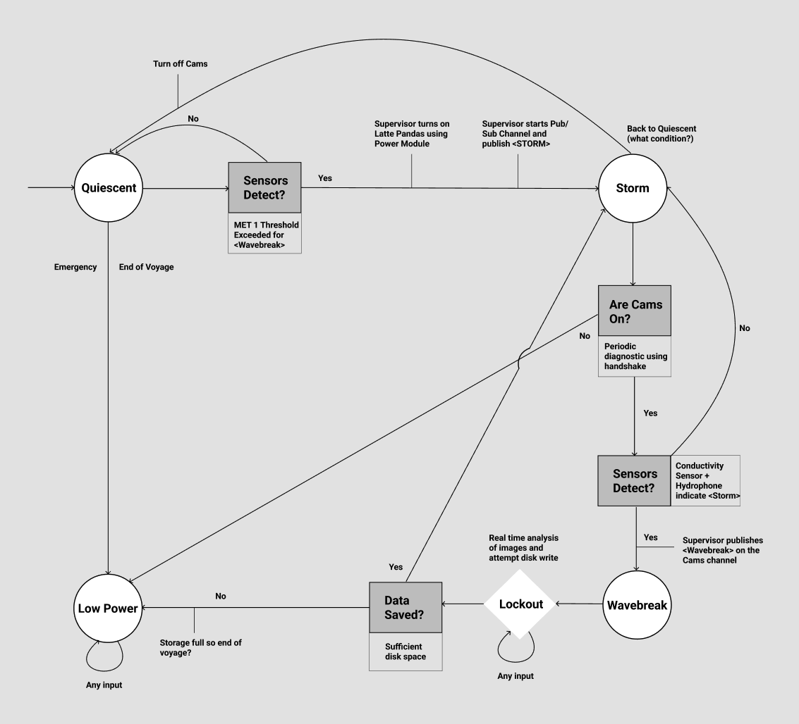
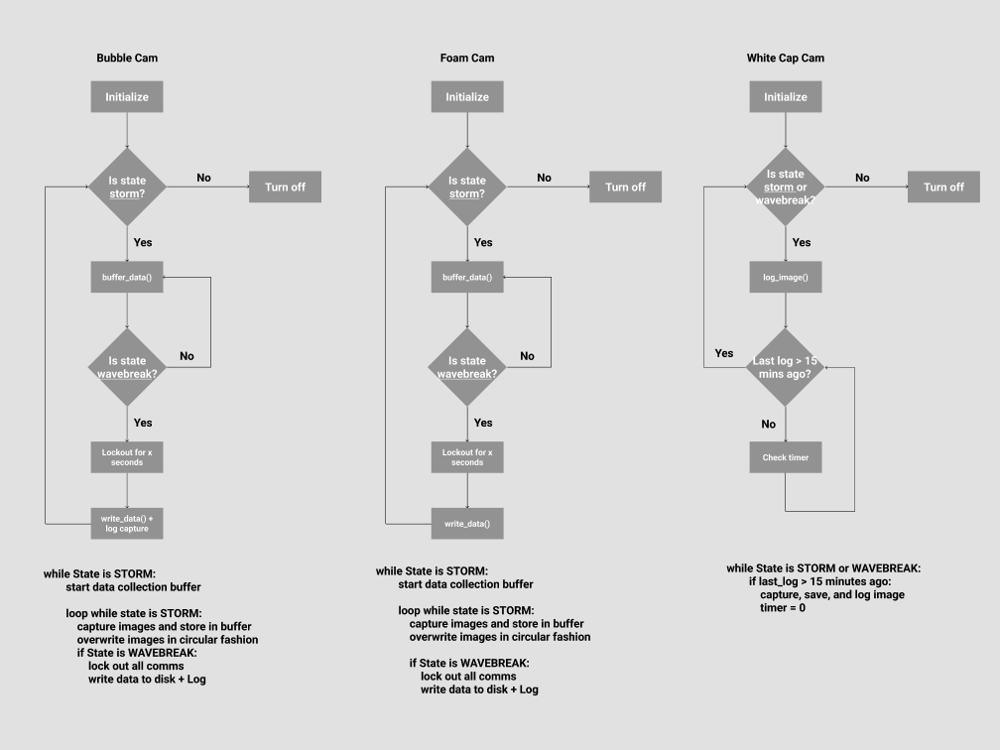

# System Outline

This directory documents the planned architecture of the Hydra data collection system.

## Overview

Each single board computer (SBC) on the Wave Glider is responsible for two high level tasks:

1. **Handle Communications** – using a publish/subscribe model. The supervisor SBC publishes state changes and event notifications while the other SBCs subscribe and react accordingly.
2. **Handle Sensors** – sensors run on their respective SBC either in their own process or as threads in a dedicated sensor process.

## System Requirements and Modules

Key requirements for the system are:

1. Sensors log data when scheduled.
2. Hardware that is not needed remains powered off.
3. SBCs share state information with each other.

The software is organized into four main modules:

### Sensor
Governs the onboard sensors, providing interfaces for power control, data capture, and logging. Direct submodules include the camera suite and various conditional/constant loggers.

### Comms
Responsible for inter‑process communication between SBCs. Uses a publisher/subscriber pattern where the supervisor SBC distributes state change messages to the other SBCs via the **SBC Communicator** submodule.

### Power
Manages power distribution for hardware, primarily through the **PDB Controller** which toggles supplies depending on system state (e.g. cameras powered down during quiescent periods).

### Logging
Formats and records operational logs. Other modules implement this interface so events and state transitions are captured consistently.

### Notes on the Camera Submodules
The camera system comprises Bubble Cam, Foam Cam and White Cap Cam. Bubble and Foam continuously buffer frames while active and flush the buffer when an event is detected. White Cap Cam captures one image every 15 minutes while in Storm or Event states.

## Hardware Specifications

The following list captures currently known compute, sensor and networking hardware. Power and dimension fields are incomplete and require further measurement.

### Compute Hardware
1. **Raspberry Pi 4b** – 85 × 56 mm, ~4.8 W start, ~3.2 W idle ×2
2. **Latte Panda** – 88 × 70 mm ×2
3. **SAMSUNG T5 Portable SSD 2TB** – 73.9 × 57.4 mm ×2
4. **Raspberry Pi Zero** – TBD

### Sensor Hardware
1. FLIR Cameras ×3
2. SITA
3. MET1
4. Conductivity Sensor – 1.8 W
5. Singular Hydrophone
6. Hydrophone Array

### Networking and Connectors
1. Network Switch
2. Ethernet Cabling
3. Breadboard Jumper Wires
4. 4‑Port RS232‑to‑USB Connector

### Power Board
1. Power Distribution Board

## Camera Class Outline

The following notes summarize the camera module design.

### `Cam` (abstract)
Fields include camera configuration parameters (exposure, gain, gamma, fps, etc.), current state, event delay and a deque buffer. Methods inherited from `Sensor` provide power control, while `Cam` adds `set_state` and an abstract `detect_event`.

### `BubbleCam`
Concrete subclass that implements `detect_event` to trigger data capture and logging when conditions are met. Frames are continuously stored in a rolling buffer while active.

## Time Synchronization

All SBCs must share a common time reference so that data from different sensors can be correlated. One approach is to synchronize the supervisor’s clock using GPS time and distribute that reference to the camera SBCs. See <https://m0iax.com/2018/11/30/setting-the-raspberry-pi-system-time-using-a-gps/> for an example technique.

## Storage Management

Further work is required to outline storage limits and how the SBCs and external SSDs will be managed.

## Additional Notes

* Bubble Cam and Foam Cam operate together so that images from both perspectives are captured for the same event.
* White Cap Cam logs an image once every 15 minutes in Storm or Event states.
* SITA and MET1 sample continuously but may power down in extreme conditions.
* The hydrophone array runs independently 24/7 while a single hydrophone near Bubble Cam logs during storm states.
* Outstanding considerations include power draw, physical layout, heat sinking, data storage requirements and secure cabling.

